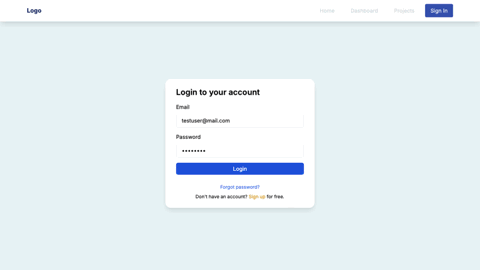

# Task Management System (Django Rest and Next JS)

Desktop Preview            |  Mobile Preview
:-------------------------:|:-------------------------:
  |  

## Description
Task Management System is a comprehensive full-stack web application built with Django Rest Framework for the backend, Next.js for the frontend. It provides an platform for users to manage projects, tasks, comments, and tags efficiently. It offers a simple, responsive interface for seamless project management and includes robust authentication capabilities using Djoser with Django REST Framework Simple JWT, ensuring secure user access and management.

Give a star if you like it, find it useful, or want to support this project! 🌟 Your support helps keep the project active and enhances its development.

If you use this project in your work or build upon it, please give proper credit and link back to [https://github.com/mimi030/](https://github.com/mimi030/). 

<details>
  <summary>Project Walkthrough</summary>
  
</details>

<details>
  <summary>Auth Walkthrough</summary>
  
</details>

## Table of Contents
- [Features](#features)
- [Technologies Used](#technologies-used)
- [Installation Instructions](#installation-instructions)
- [Usage](#usage)
- [API Documentation](#api-documentation)
- [Planned Features](#planned-features)
- [Contributing](#contributing)
- [License](#license)
- [Acknowledgments](#acknowledgments)

## Features

- **User Authentication and Authorization**
  - Includes registration, account activation, login, and logout.
  - Password reset functionality with JWT tokens.

- **Token Cookies**
  - Stores user login tokens in cookies for a set duration.
  - Automatically handles token expiration and blocks timed-out tokens.

- **Project and Task Management**
  - **Project Visibility:** Only project owners and members assigned to a project can view the corresponding project and its tasks.
  - Create and manage projects, tasks, comments, and tags.
  - Project owner can assign members to projects and allocate tasks.
  - Edit project and task details, including status updates.
  - Users can leave comments on tasks to facilitate collaboration.

- **Navigation**
  - **Sidebar:** Provides easy access to various sections of the app with a responsive design that adjusts based on user interaction.
  - **Breadcrumb:** Shows the current page’s location within the app hierarchy, helping users navigate back to previous pages or higher levels in the hierarchy.

- **Responsive Design**
  - Optimized for both mobile and desktop viewing experiences.

- **Security**
   - **Content Security Policy (CSP) Settings:** 
     - To protect against XSS attacks, ensure you configure the CSP in your application.
     - Adjust these settings on backend (task_management_system) and frontend based on your application’s requirements.

## Technologies Used
- **Frontend**: React, Next.js, TypeScript, Tailwind CSS
- **Backend**: Django, Django REST Framework
- **Database**: SQLite
- **Authentication**: Djoser, JWT (JSON Web Tokens)
- **Data Fetching and Management**: Djoser, JWT (JSON Web Tokens)
  - **Axios:** Used for making HTTP requests from the frontend to the backend.  
  - **useSWR:** A React Hook library for data fetching and caching.
  - **Fetcher:** A utility function used with useSWR to handle API requests.

## Installation Instructions

### Prerequisites
- Python 3.11.x (for Django backend)
- Django 5.0.x (with Django REST framework)
- Next.js 14.x (for the frontend)
- Node.js v18.17.x and npm/yarn (for managing Next.js dependencies)
- SQLite or any supported database (for Django database)

### Backend Setup
1. Clone the repository:
   ```bash
   git clone https://github.com/mimi030/task_management_system_django_next_v1.git
   cd task_management_system_django_next_v1/task_management_system
   ```

2. Create a virtual environment and install dependencies:
   ```bash
   python3.11 -m venv venv
   source venv/bin/activate  # On Windows use `venv\Scripts\activate`
   pip install -r requirements.txt
   ```

3. Set up environment variables:
   Create a `.env` file in the backend directory and add the required environment variables (e.g., `DATABASE_URL`, `SECRET_KEY`).

4. Run database migrations:
   ```bash
   python manage.py makemigrations
   python manage.py migrate
   ```

5. Create superuser:
   ```bash
   python manage.py createsuperuser
   ```

6. Start the backend server:
   ```bash
   python manage.py runserver
   ```

### Frontend Setup
1. Navigate to the frontend directory:
   ```bash
   cd ../frontend
   ```

2. Install dependencies:
   If you are using npm
   ```bash
   npm install
   ```

   Or if you are using yarn
   ```bash
   yarn install
   ```

3. Set up environment variables:
   Create a `.env` file in the frontend directory and add the required environment variables (e.g., `NEXT_PUBLIC_API_BASE_URL`).

4. Start the frontend server:
   If you are using npm
   ```bash
   npm run dev
   ```

   Or if you are using yarn
   ```bash
   yarn dev
   ```

5. Build the project for production:
   To create an optimized production build, use:

   If you are using npm
   ```bash
   npm run build
   ```

   Or if you are using yarn
   ```bash
   yarn build
   ```

6. Start the production server:
   To run the production build, use:

   If you are using npm
   ```bash
   npm start
   ```

   Or if you are using yarn
   ```bash
   yarn start
   ```

## Usage
- Open your browser and navigate to `http://localhost:3000` to access the application.
- Use the provided authentication routes to log in or sign up.
- Navigate to `http://localhost:8000/admin` to access the Django admin interface and manage the system if you are a superuser.

## API Documentation

### Authentication Endpoints
| Method | Endpoint                            | Description                            |
|--------|-------------------------------------|----------------------------------------|
| POST   | `/api/v1/auth/jwt/create/`          | Log in to an account (used for authentication via JWT)|
| POST   | `/api/v1/auth/users/`               | Register a new account|
| POST   | `/api/v1/auth/users/activation/`    | Activate a newly registered account|
| POST   | `/api/v1/auth/users/reset_password/` | Initiate a password reset via email|
| POST   | `/api/v1/auth/users/reset_password_confirm/` | Confirm password reset with a new password|
| POST   | `/api/v1/auth/logout/`          | Log out from the account (invalidate the token)|

### Project Endpoints
| Method | Endpoint                            | Description                            |
|--------|-------------------------------------|----------------------------------------|
| GET    | `/api/v1/projects/`                 | List all projects                      |
| POST   | `/api/v1/projects/`                 | Create a new project                   |
| PUT    | `/api/v1/projects/{project_id}/`    | Update a project                       |
| DELETE | `/api/v1/projects/{project_id}/`    | Delete a project and all relevant tasks|

### Task Endpoints
| Method | Endpoint                            | Description                            |
|--------|-------------------------------------|----------------------------------------|
| GET    | `/api/v1/projects/{project_id}/tasks/` | List all tasks for a project|
| POST   | `/api/v1/projects/{project_id}/tasks/` | Create a new task for a project|
| GET    | `/api/v1/projects/{project_id}/tasks/{task_id}/` | Get details of a specific task|
| PUT    | `/api/v1/projects/{project_id}/tasks/{task_id}/` | Update a specific task|
| DELETE | `/api/v1/projects/{project_id}/tasks/{task_id}/` | Delete a specific task|

### Comment Endpoints
| Method | Endpoint                            | Description                            |
|--------|-------------------------------------|----------------------------------------|
| GET    | `/api/v1/projects/{project_id}/tasks/{task_id}/comments/` | List all comments for a specific task|
| POST   | `api/v1/projects/{project_id}/tasks/{task_id}/comments/` | Add a comment to a specific task|
| PUT    | `/api/v1/projects/{project_id}/tasks/{task_id}/comments/{comment_id}/` | Update a comment on a specific task|
| DELETE | `/api/v1/projects/{project_id}/tasks/{task_id}/comments/{comment_id}/` | Delete a comment from a specific task|

### Tag Endpoints
| Method | Endpoint                            | Description                            |
|--------|-------------------------------------|----------------------------------------|
| GET    | `/api/v1/all-tags/` | List all tags|

### Request Example
```http
GET http://localhost:8000/api/v1/projects/
Authorization: Bearer <token>
```

### Response Example
```json
[
  "created_at": "yyyy-mm-ddThh:mm:ss.ssssssZ",
   "description": "This is a project description...",
   "id": 1,
   "is_owner": true,
   "members": [
      {
            "email": "testuser@mail.com",
            "first_name": "User",
            "id": 2,
            "last_name": "Test",
            "username": "testuser"
      }
   ],
   "name": "New Project",
   "owner": "testadmin",
   "tasks": [
      {
         "assigned_to": [
            {
               "email": "testuser@mail.com",
               "first_name": "User",
               "id": 2,
               "last_name": "Test",
               "username": "testuser"
            }
         ],
         "created_at": "yyyy-mm-ddThh:mm:ss.ssssssZ",
         "description": "This is a task description...",
         "due_date": "2024-07-28T15:00:00Z",
         "id": 1,
         "name": "Task 1",
         "project": 1,
         "status": "in_progress",
         "tags": [
            {
               "id": 1,
               "name": "Test"
            }
         ],
         "updated_at": "yyyy-mm-ddThh:mm:ss.ssssssZ"
      }
   ]
]
```

## Planned Features
The following features and improvements are planned for future updates in this repository:

- **Add Timeline Schedule**: Implement a calendar view to display projects and tasks.
- **Continuous Integration**: Set up CI to run tests and linting automatically.
- **Code Refactoring**: Improve code quality and structure.
- **Expand Test Coverage**: Add more tests to ensure robustness.

## Contributing
Contributions are always appreciated! Whether it’s a new feature, bug fix, or an improvement, your efforts help make this project better. Suggestions are also welcomed. Please feel free to open an issue if you have ideas or feedback.

Here’s how you can contribute:

1. Fork the repository
2. Create a new branch (`git checkout -b feature/YourFeature`)
3. Commit your changes (`git commit -am 'Add new feature'`)
4. Push to the branch (`git push origin feature/YourFeature`)
5. Open a Pull Request

If you're not sure about implementing something but have a suggestion, please don't hesitate to [open an issue](https://github.com/mimi030/task_management_system_django_next/issues). Your ideas are valuable to the ongoing development of the project.

## License
This project is licensed under the MIT License - see the [LICENSE](LICENSE) file for details.

## Acknowledgments
- Inspired by various open-source projects and resources, such as using cookies to enhance security by [koladev32](https://github.com/koladev32/django-nextjs-auth/tree/main).
- Special thanks to [Django](https://www.djangoproject.com/) and [React](https://reactjs.org/) for their excellent frameworks.
